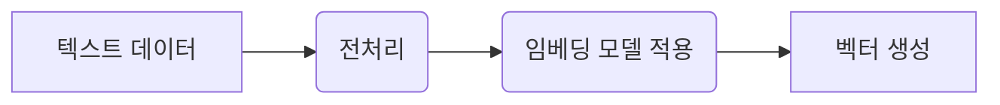
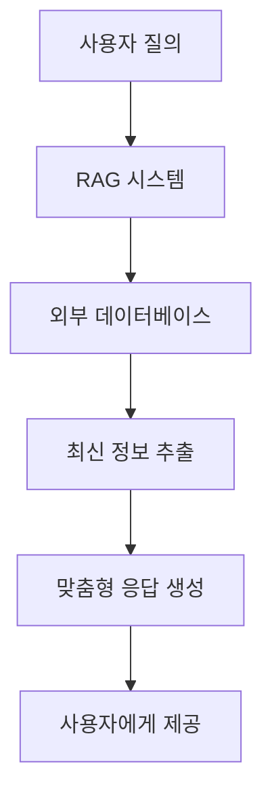

# RAG와 임베딩을 활용한 LLM 강화

최근 인공지능 분야에서 대형 언어 모델(LLM, Large Language Models)은 다양한 작업에서 큰 성과를 보이고 있습니다. 하지만 이들 모델은 **환각(hallucination)**이나 **최신 정보 반영의 한계** 등 여러 문제점이 존재합니다. 이러한 문제를 보완하기 위해 등장한 기술이 바로 **Retrieval-Augmented Generation (RAG)**와 **임베딩(Embedding)**입니다.

---

## 1. RAG란 무엇인가?

**Retrieval-Augmented Generation (RAG)**은 LLM이 단순히 사전에 학습한 내용만으로 답변을 생성하는 것이 아니라, **외부의 신뢰할 수 있는 데이터베이스나 문서 집합**에서 필요한 정보를 검색하여 답변을 생성하는 방식입니다. 이를 통해 최신 정보 반영과 환각 문제를 크게 줄일 수 있습니다.

### RAG의 주요 특징
- **최신 정보 반영**: 외부 데이터베이스를 실시간으로 검색하여 최신 정보를 활용합니다.
- **환각 최소화**: 모델이 학습하지 않은 정보를 생성하는 문제를 보완합니다.
- **도메인 특화 응답**: 특정 분야의 지식 베이스를 활용하여 전문적인 답변을 제공합니다.

### RAG 작동 원리 다이어그램

---

## 2. 임베딩 기술의 이해

임베딩은 텍스트 데이터를 **수치 벡터**로 변환하여, 텍스트 간의 의미적 유사성을 계산할 수 있게 하는 기술입니다. RAG의 핵심 요소 중 하나로, 문서와 질문 모두를 벡터화하여 검색 및 응답 생성에 활용됩니다.

### 임베딩 방법

#### 빈도 기반 임베딩

- **TF-IDF**: 각 단어의 출현 빈도와 역문서 빈도를 계산하여 벡터를 생성합니다.
  - **장점**: 계산이 간단합니다.
  - **단점**: 문맥 정보 반영의 한계가 있습니다.

#### 분산 표현 임베딩

- **Word2Vec, GloVe**: 단어를 고차원 벡터로 표현하여 의미적 유사성을 반영합니다.
- **BERT 및 Sentence-BERT**: 문장 전체의 문맥과 의미를 양방향으로 반영하여 임베딩을 생성합니다.

### 임베딩 프로세스 다이어그램

---

## 3. RAG와 임베딩의 활용 사례

RAG와 임베딩 기술은 다양한 분야에서 활용되어, 사용자에게 최신 정보와 정확한 답변을 제공합니다.

### 활용 분야 예시

- **검색 엔진**: 최신 데이터베이스를 참조하여, 사용자의 질의에 대해 보다 정확한 검색 결과를 제공합니다.
- **질문-응답 시스템**: 특정 도메인의 전문 지식을 활용하여, 신뢰성 있는 답변을 생성합니다.
- **전자상거래**: 사용자 질의와 제품 정보를 결합하여, 맞춤형 제품 추천 및 정보를 제공합니다.

### 활용 사례 다이어그램

---

## 4. 결론

RAG와 임베딩 기술은 LLM의 기존 한계를 극복하고, 더욱 신뢰할 수 있는 AI 응답 시스템을 구축하는 데 중요한 역할을 합니다. 최신 정보를 반영하고 환각 문제를 줄이는 이러한 기술은 앞으로도 다양한 분야에서 그 활용도가 더욱 높아질 것으로 기대됩니다.

---

**참고 자료:**
- [RAG를 통해 LLM을 좀 더 피우게 하는 연결 '임베딩 모델'은 어떻게 활용되고 있을까](https://introduce-ai.tistory.com/entry/RAG%EB%A5%BC-%ED%86%B5%ED%95%B4-LLM%EC%9D%84-%EA%BD%83-%ED%94%BC%EC%9A%B0%EA%B2%8C%ED%95%98%EB%8A%94-%EC%A1%B0%EC%97%B0-%E2%80%98%EC%9E%84%EB%B2%A0%EB%94%A9-%EB%AA%A8%EB%8D%B8%E2%80%99%EC%9D%80-%EC%96%B4%EB%96%BB%EA%B2%8C-%ED%9D%98%EB%9F%AC%EA%B0%80%EA%B3%A0-%EC%9E%88%EC%9D%84%EA%B9%8C)
- [AWS: What is Retrieval-Augmented Generation](https://aws.amazon.com/ko/what-is/retrieval-augmented-generation/)
- [Brunch 관련 글](https://brunch.co.kr/@ywkim36/146)

